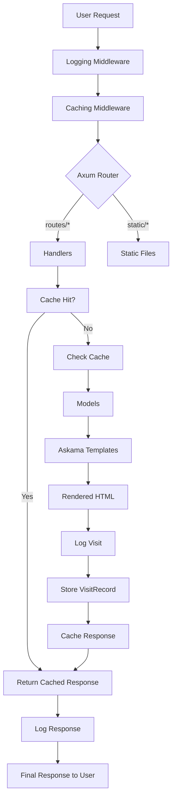

# Ethan-Web Portfolio Project Plan

## Project Overview
This project builds a college application portfolio website for Ethan using Axum (Rust web framework) and Askama (templating engine). The site will showcase achievements and resume information with advanced features including page caching, comprehensive user action auditing, and visit tracking.

## Architecture Overview
The application follows a modular structure separating concerns into data models, request handling, presentation, caching, and logging. Key features include:

- **Caching**: Moka-based in-memory caching with versioning for cache invalidation after updates (no TTL)
- **Logging**: Thorough tracing-based audit logging for all user interactions
- **Tracking**: User visit tracking using IP addresses to monitor page access patterns

### Architecture Diagram

## Project Modules and Roles

- **Main Module (`src/main.rs`)**: Application entry point initializing middleware, routes, and server setup. Handles caching and logging configuration.

- **Cache Module (`src/cache.rs`)**: Manages Moka cache operations including versioning for invalidation, get/set methods for page responses.

- **Logging Module (`src/logging.rs`)**: Configures tracing for structured logging of user actions, requests, and responses with fields like IP, timestamp, action type.

- **Models Module (`src/models.rs`)**: Defines data structures:
  - `Achievement`: Title, description, date
  - `ResumeItem`: Education, skills, experience
  - `VisitRecord`: IP, page, timestamp for analytics

- **Handlers Module (`src/handlers.rs`)**: Route handlers implementing caching checks, visit logging, user tracking, and cache invalidation on data updates.

- **Askama Templates (`templates/` dir)**: HTML templates for rendering portfolio pages with shared layouts and page-specific content.

- **Static Files (`static/` dir)**: Assets (CSS, JS, images, media) served with version-based caching headers.

## Dependencies
- `axum`: Web framework for routing and middleware
- `askama`: Templating engine for HTML rendering
- `moka`: In-memory caching with configurable policies
- `tracing`: Structured logging and diagnostics

## TODO List

### Pending Tasks
- [ ] Add Askama and moka dependencies to Cargo.toml (moka for caching, tracing for logging)
- [ ] Set up basic Axum web server structure in main.rs with middleware for comprehensive logging and caching by versioning
- [ ] Create models.rs for data structures including Achievement, ResumeItem, VisitRecord for tracking page visits
- [ ] Implement route handlers in handlers.rs with view tracking and cache invalidation on data updates
- [ ] Create logging module for auditing user actions (page visits, data access)
- [ ] Create Askama templates directory with base layout and specific page templates
- [ ] Add static file serving for assets with caching headers by version
- [ ] Populate models with sample data and implement versioning for cache clearing
- [ ] Test the portfolio site with full logging, caching, and visit tracking functionality

### Completed Tasks
None yet. Implementation will begin after plan approval.

## Implementation Notes
- Media files currently in `src/` (interview.m4a, interview.mp4, interview.weba, output files) should be moved to `static/` for asset serving
- Versioning system uses a global counter incremented on any data updates to invalidate caches
- User identification relies on IP addresses for simplicity; sessions not required for basic tracking
- Logging outputs to stdout/file with configurable verbosity